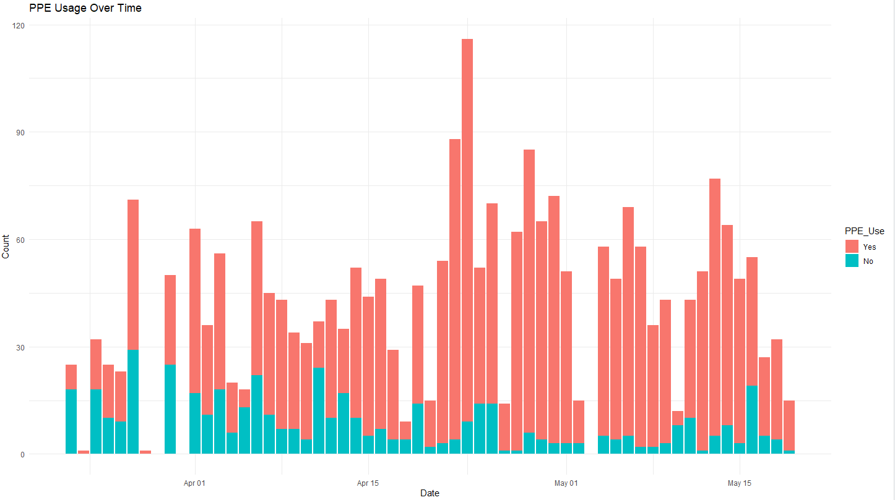
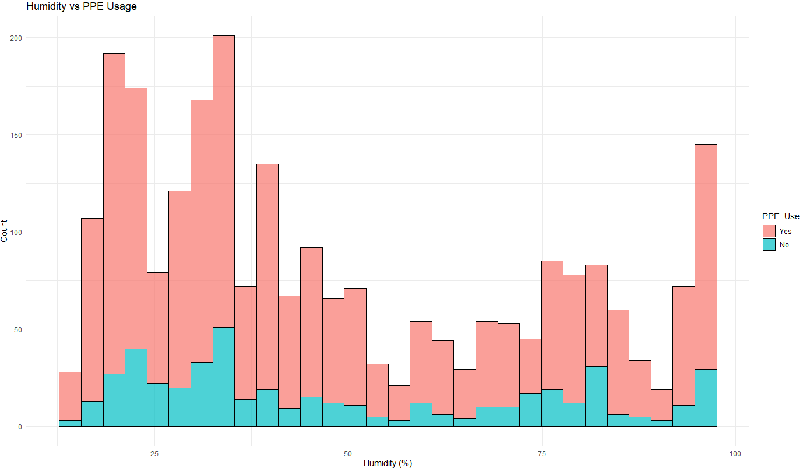
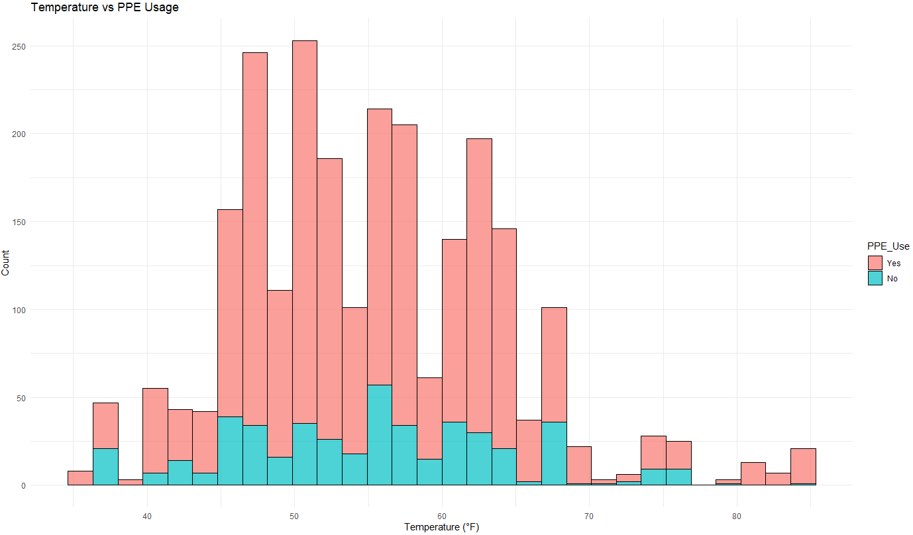
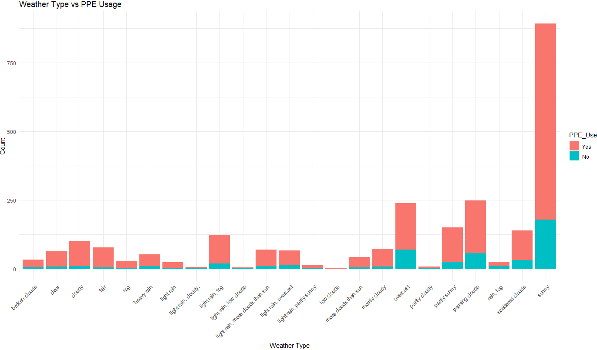

# 😷 PPE-Usage-Weather-Analysis
An exploratory data analysis looking at the relationship between weather conditions and personal protective equipment (PPE) usage, aiming to understand how temperature, humidity, and weather types can influence PPE compliance.
  

## Context
This analysis extends NYU's DETER project ([See Publication Here](https://www.nature.com/articles/s41597-023-02692-0)), funded by the National Science Foundation, which collected time-sensitive data on egress behaviors and neighborhood conditions around healthcare centers (HCCs) in New York City during the initial COVID-19 PAUSE order from March 22 to May 19, 2020. The original dataset contains anonymized observational field data, with researchers recording details of egress behaviors, such as the day and time of travel, destination type, and surrounding weather conditions and socio-economic factors. This extension investigates how PPE usage correlates with environmental factors, including weather and temperature, and egress behavior. By analyzing data from NYC healthcare centers, the goal is to explore how these variables impacted PPE usage and egress patterns during the pandemic.

Word Count: 122 words
  

## Results and Analysis
This exploratory analysis used univariate and bivariate visualizations to examine trends in PPE usage over time, weather types, and temperature and humidity, resulting in [four bar charts](BarCharts). The analysis found no significant variation in PPE usage over time, with the highest usage between April 15 and May 1. PPE usage was more common in lower humidity levels, particularly in the 10-50% range. There was a clear pattern of increased PPE usage in moderate temperatures, especially between 45°F and 65°F. More PPE was used on sunny days, though this could be biased, as more people were likely outdoors in sunny weather. Stacked bar charts were chosen to effectively show PPE usage across different conditions, with colors distinguishing between "Yes" and "No." Future improvements could include exploring different visualizations or refining chart layouts for better clarity.

Note that limitations arise from the nature of the egress data, as increased PPE usage may not reflect more people wearing PPE but could be due to short observation periods by data collectors (e.g., when people entered nearby subway stations). Overall, this project provided valuable hands-on experience in exploratory data analysis, data cleaning, and preprocessing workflows.

Word Count: 190 words
  

## Outputs

  

## Language Used
- **R**
